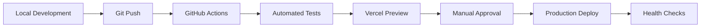

# CTO Technical Manual - Santana AI Counselor Platform
## Complete System Maintenance & Operations Guide

---

## 🎯 **Executive Summary**
This manual provides comprehensive technical guidance for maintaining, scaling, and optimizing the Santana AI Counselor platform. As CTO, you'll oversee a production-ready, multi-tenant fertility counseling platform serving multiple clinics.

---

## 🏗️ **System Architecture Overview**

### **Technology Stack**
- **Frontend:** React 18 + TypeScript + Tailwind CSS
- **Backend:** Node.js + Vercel Serverless Functions
- **Database:** PostgreSQL with Prisma ORM
- **Authentication:** JWT with role-based access control
- **Deployment:** Vercel (Production) + GitHub (Source Control)
- **Monitoring:** Built-in health checks + real-time diagnostics

### **Core Components**
```
┌─────────────────┐    ┌─────────────────┐    ┌─────────────────┐
│   Frontend      │    │   API Layer     │    │   Database      │
│   React App     │◄──►│   Serverless    │◄──►│   PostgreSQL    │
│   Multi-tenant  │    │   Functions     │    │   Multi-tenant  │
└─────────────────┘    └─────────────────┘    └─────────────────┘
         │                       │                       │
         ▼                       ▼                       ▼
┌─────────────────┐    ┌─────────────────┐    ┌─────────────────┐
│   External      │    │   Email         │    │   Payment       │
│   EMR Systems   │    │   Services      │    │   Processing    │
│   (Epic/Cerner) │    │   (SendGrid)    │    │   (Stripe)      │
└─────────────────┘    └─────────────────┘    └─────────────────┘
```

---

## 🔧 **Daily Operations**

### **1. System Health Monitoring**

**Daily Checks (5 minutes):**
```bash
# Access production readiness dashboard
https://your-app.vercel.app/production-readiness

# Check system health
https://your-app.vercel.app/system-health

# Review admin debug dashboard
https://your-app.vercel.app/admin-debug
```

**Key Metrics to Monitor:**
- **Response Times:** < 200ms average
- **Error Rate:** < 0.5%
- **Database Connections:** < 80% of pool
- **Memory Usage:** < 85%
- **API Success Rate:** > 99%

### **2. Database Maintenance**

**Weekly Tasks:**
```sql
-- Check database performance
SELECT * FROM pg_stat_activity WHERE state = 'active';

-- Monitor connection pool
SELECT count(*) as active_connections FROM pg_stat_activity;

-- Check slow queries
SELECT query, mean_time, calls 
FROM pg_stat_statements 
ORDER BY mean_time DESC LIMIT 10;
```

**Monthly Tasks:**
- Database backup verification
- Index optimization review
- Storage usage analysis
- Performance tuning

### **3. Security Monitoring**

**Weekly Security Checks:**
- SSL certificate expiration (auto-renews)
- Environment variable security audit
- Access log review
- Failed authentication attempts analysis

---

## 📈 **Scaling Operations**

### **Traffic Scaling Thresholds**

| Metric | Current | Scale Up At | Action Required |
|--------|---------|-------------|-----------------|
| Concurrent Users | 100 | 500 | Upgrade Vercel plan |
| Database Connections | 10 | 80 | Connection pooling optimization |
| API Requests/min | 1,000 | 5,000 | Rate limiting review |
| Storage Usage | 1GB | 8GB | Database optimization |

### **Horizontal Scaling Strategy**

**Phase 1: Current (0-1,000 users)**
- Vercel Hobby/Pro plan
- Single PostgreSQL instance
- Basic monitoring

**Phase 2: Growth (1,000-10,000 users)**
- Vercel Pro plan
- Database read replicas
- Advanced monitoring (DataDog/New Relic)
- CDN optimization

**Phase 3: Enterprise (10,000+ users)**
- Vercel Enterprise
- Database sharding by clinic
- Microservices architecture
- Multi-region deployment

---

## 🔐 **Security Management**

### **Environment Variables Management**

**Production Environment Variables:**
```bash
# Database
DATABASE_URL=postgresql://...
PRISMA_DATABASE_URL=postgresql://...

# Authentication
JWT_SECRET=your-super-secure-secret-64-chars-minimum

# Application
NEXT_PUBLIC_APP_URL=https://your-domain.com
NODE_ENV=production

# Email Services (Configure as needed)
SENDGRID_API_KEY=SG.xxx
MAILGUN_API_KEY=key-xxx
MAILGUN_DOMAIN=mg.yourdomain.com

# Payment Services (Configure as needed)
STRIPE_SECRET_KEY=sk_live_xxx
STRIPE_PUBLISHABLE_KEY=pk_live_xxx
RAZORPAY_KEY_ID=rzp_live_xxx
RAZORPAY_KEY_SECRET=xxx

# EMR Integration (Configure per clinic request)
EPIC_BASE_URL=https://fhir.epic.com/...
EPIC_CLIENT_ID=xxx
EPIC_CLIENT_SECRET=xxx
```

**Security Best Practices:**
1. **Rotate secrets quarterly**
2. **Use environment-specific variables**
3. **Never commit secrets to git**
4. **Audit access logs monthly**
5. **Enable 2FA for all admin accounts**

### **Backup Strategy**

**Database Backups:**
- **Automated:** Daily full backups
- **Point-in-time:** 7-day recovery window
- **Testing:** Monthly restore tests
- **Storage:** Encrypted, geographically distributed

**Code Backups:**
- **Git:** All code in GitHub
- **Deployment:** Vercel automatic deployments
- **Rollback:** Instant rollback capability

---

## 🚨 **Incident Response**

### **Severity Levels**

**P0 - Critical (Response: Immediate)**
- Complete system outage
- Data breach or security incident
- Payment processing failure

**P1 - High (Response: 1 hour)**
- Partial system outage
- Database connectivity issues
- Authentication failures

**P2 - Medium (Response: 4 hours)**
- Performance degradation
- Non-critical feature failures
- Email delivery issues

**P3 - Low (Response: 24 hours)**
- Minor bugs
- UI/UX issues
- Documentation updates

### **Incident Response Playbook**

**Step 1: Assessment (5 minutes)**
```bash
# Check system status
curl https://your-app.vercel.app/api/data?type=system-health

# Check Vercel status
https://vercel-status.com

# Check database status
psql $DATABASE_URL -c "SELECT 1;"
```

**Step 2: Communication (10 minutes)**
- Notify stakeholders via Slack/email
- Update status page if available
- Document incident start time

**Step 3: Resolution**
- Follow specific playbooks below
- Implement temporary fixes if needed
- Monitor system recovery

**Step 4: Post-Incident**
- Conduct post-mortem within 48 hours
- Update documentation
- Implement preventive measures

---

## 🔄 **Deployment Management**

### **Deployment Pipeline**



**Deployment Commands:**
```bash
# Deploy to production
vercel --prod

# Deploy preview
vercel

# Check deployment status
vercel ls

# View logs
vercel logs

# Environment variable management
vercel env add VARIABLE_NAME production
vercel env ls
vercel env rm VARIABLE_NAME production
```

### **Release Management**

**Release Schedule:**
- **Hotfixes:** As needed (P0/P1 issues)
- **Minor releases:** Bi-weekly
- **Major releases:** Monthly
- **Security updates:** Immediate

**Pre-deployment Checklist:**
- [ ] All tests passing
- [ ] Security scan completed
- [ ] Database migrations tested
- [ ] Rollback plan prepared
- [ ] Stakeholders notified

---

## 📊 **Performance Optimization**

### **Database Optimization**

**Query Optimization:**
```sql
-- Add indexes for common queries
CREATE INDEX idx_patients_clinic_id ON patients(clinic_id);
CREATE INDEX idx_appointments_date ON appointments(date);
CREATE INDEX idx_users_email ON users(email);

-- Analyze query performance
EXPLAIN ANALYZE SELECT * FROM patients WHERE clinic_id = 'xxx';
```

**Connection Pooling:**
```javascript
// Prisma configuration
const prisma = new PrismaClient({
  datasources: {
    db: {
      url: process.env.DATABASE_URL
    }
  },
  log: ['error'],
  // Connection pooling
  __internal: {
    engine: {
      connectionLimit: 10
    }
  }
})
```

### **API Optimization**

**Caching Strategy:**
- **Static assets:** CDN caching (1 year)
- **API responses:** Redis caching (5 minutes)
- **Database queries:** Query result caching (1 minute)

**Rate Limiting:**
```javascript
// Current limits
const rateLimits = {
  general: '1000 requests/hour',
  auth: '10 requests/minute',
  upload: '100 requests/hour'
}
```

---

## 🔧 **Troubleshooting Guide**

### **Common Issues & Solutions**

**1. Database Connection Errors**
```bash
# Check connection
psql $DATABASE_URL -c "SELECT version();"

# Check connection pool
SELECT count(*) FROM pg_stat_activity;

# Solution: Restart connection pool or scale database
```

**2. High Response Times**
```bash
# Check API performance
curl -w "@curl-format.txt" -s -o /dev/null https://your-app.vercel.app/api/health

# Check database performance
SELECT query, mean_time FROM pg_stat_statements ORDER BY mean_time DESC LIMIT 5;

# Solution: Optimize queries or add caching
```

**3. Authentication Issues**
```bash
# Verify JWT secret
echo $JWT_SECRET | wc -c  # Should be > 32 characters

# Check token validation
curl -H "Authorization: Bearer $TOKEN" https://your-app.vercel.app/api/data?type=dashboard

# Solution: Regenerate JWT secret or fix token validation
```

---

## 📈 **Monitoring & Alerting**

### **Key Metrics Dashboard**

**System Metrics:**
- Response time (target: < 200ms)
- Error rate (target: < 0.5%)
- Uptime (target: > 99.9%)
- Database connections (target: < 80%)

**Business Metrics:**
- Active clinics
- Total patients
- Monthly recurring revenue
- Feature adoption rates

### **Alert Configuration**

**Critical Alerts:**
- System downtime > 1 minute
- Error rate > 5%
- Database connections > 90%
- Payment processing failures

**Warning Alerts:**
- Response time > 500ms
- Error rate > 1%
- Database connections > 80%
- SSL certificate expiring < 30 days

---

## 🚀 **Future Roadmap**

### **Q1 2025: Stability & Performance**
- [ ] Implement comprehensive monitoring
- [ ] Database performance optimization
- [ ] Security audit and hardening
- [ ] Load testing and capacity planning

### **Q2 2025: Advanced Features**
- [ ] Real-time notifications
- [ ] Advanced analytics dashboard
- [ ] Mobile app development
- [ ] API rate limiting improvements

### **Q3 2025: Scale & Integration**
- [ ] Multi-region deployment
- [ ] Advanced EMR integrations
- [ ] Third-party API marketplace
- [ ] Enterprise SSO integration

### **Q4 2025: Innovation**
- [ ] AI/ML model improvements
- [ ] Predictive analytics
- [ ] Advanced reporting
- [ ] Compliance automation

---

## 📞 **Emergency Contacts**

**Technical Escalation:**
- **Primary:** CTO (You)
- **Secondary:** Lead Developer
- **Database:** Database Administrator
- **Security:** Security Team Lead

**Vendor Contacts:**
- **Vercel Support:** support@vercel.com
- **Database Provider:** [Your DB provider]
- **Email Service:** SendGrid/Mailgun support
- **Payment Processor:** Stripe/Razorpay support

---

## 📚 **Additional Resources**

**Documentation:**
- [Vercel Documentation](https://vercel.com/docs)
- [Prisma Documentation](https://www.prisma.io/docs)
- [React Documentation](https://react.dev)

**Monitoring Tools:**
- Production Readiness: `/production-readiness`
- System Health: `/system-health`
- Admin Debug: `/admin-debug`

**Code Repository:**
- GitHub: [Your repository URL]
- Deployment: Vercel Dashboard

---

*This manual should be reviewed and updated quarterly to reflect system changes and improvements.*
